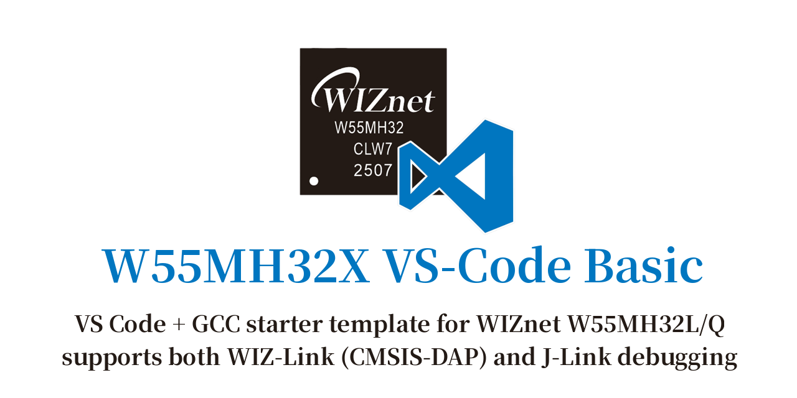

<!-- markdownlint-disable MD033 MD041 -->
<p align="center">
  
</p>

<p align="center">
  
  
  
</p>
<!-- markdownlint-enable MD033 MD041 -->

## Overview

A minimal Visual Studio Code + CMake template for **WIZnet W55MH32**
firmware development on a Cortex-M3 core. The project pairs the vendor
Standard Peripheral Library (SPL) with `arm-none-eabi-gcc`, Ninja, and
cortex-debug so that a fresh clone can configure, build, flash, and
debug without further setup.

The repository is organized to keep vendor code (CMSIS, SPL drivers,
DSP libraries) untouched while application code lives under `core/`.

## Requirements

| Tool | Version | Notes |
| ---- | ------- | ----- |
| `arm-none-eabi-gcc` | 10.3+ | C11 / C++17 capable |
| CMake | 3.25+ | Required for `CMakeUserPresets.json` preset schema v6 |
| Ninja | any recent | Used by all presets |
| Visual Studio Code | latest | Workspace ships recommended extensions |
| pyOCD + WIZ-Link | optional | For flashing/debugging (via `.vscode/launch.json`) |

Recommended VS Code extensions are pulled in automatically from
`.vscode/extensions.json` (Cortex-Debug, CMake Tools, C/C++ IntelliSense,
ARM syntax, linker script highlighting).

## Project Structure

```text
.
├── CMakeLists.txt              Root project + executable target
├── CMakeUserPresets.json.example  Preset template → copy to CMakeUserPresets.json
├── cmake/
│   ├── gcc-arm-none-eabi.cmake Toolchain (cortex-m3, soft FP)
│   └── w55mh32/
│       └── CMakeLists.txt      INTERFACE library bundling SPL + CMSIS
├── core/
│   ├── inc/                    Application headers (main.h, *_it.h, conf)
│   └── src/                    main.c, w55mh32_it.c, w55mh32_msp.c,
│                               syscalls.c + sysmem.c (newlib stubs),
│                               CMSIS system/core sources
├── drivers/
│   ├── CMSIS/Device/WIZnet/W55MH32X/   CMSIS device pack (inc, lib, pack, svd, flash)
│   └── W55MH32X_Driver/                Vendor SPL (inc/src/lib/cryptlib)
├── docs/                       Reference manuals + datasheet (PDF)
├── startup_w55mh32.s           Cortex-M3 startup (vector table, SystemInit)
├── w55mh32x_flash.ld           GNU LD linker script (flash + SRAM layout)
└── .vscode/                    Team-shared tasks, launch, IntelliSense
```

## Getting Started

```bash
# 1. Clone
git clone https://github.com/uoohyo/w55mh32x_vscode_basic.git
cd w55mh32x_vscode_basic

# 2. Create your local presets (REQUIRED — see "Local presets" below)
cp CMakeUserPresets.json.example CMakeUserPresets.json
#    then edit ARM_TOOLCHAIN_DIR and strip the // comment lines

# 3. Configure (Debug)
cmake --preset debug

# 4. Build
cmake --build --preset debug

# 5. Output
#    build/debug/w55mh32x_vscode_basic.elf
#    build/debug/w55mh32x_vscode_basic.hex
#    build/debug/w55mh32x_vscode_basic.bin
```

Swap `debug` for `release` to get an optimized build.

### Local presets (required)

The build presets (`debug` / `release`) live in `CMakeUserPresets.json`,
which is **gitignored** so machine-specific toolchain paths never reach the
shared repo. A fresh clone has no `CMakeUserPresets.json`, so you must create
one from the template before configuring — otherwise CMake reports a missing
preset:

```bash
cp CMakeUserPresets.json.example CMakeUserPresets.json
```

Then edit `CMakeUserPresets.json`:

1. Set `ARM_TOOLCHAIN_DIR` to your own `arm-none-eabi-gcc` `bin/` directory,
   or delete the line if the toolchain is already on your `PATH`.
2. Remove every `// ...` comment line — always strip all comments so the
   preset file parses cleanly.

With `cmake.useCMakePresets` enabled, the VS Code CMake Tools extension picks
up `ARM_TOOLCHAIN_DIR` automatically when you select the `debug` / `release`
preset.

Inside VS Code, hit `Ctrl+Shift+B` to run the default **Build (debug)**
task. Additional **CMake: configure** and **Clean** tasks are available
from the task list. Flashing and debugging are driven by the
Cortex-Debug launch configurations in `.vscode/launch.json` (pyOCD +
WIZ-Link).

> **Note:** All build presets (`debug` / `release`) live in
> `CMakeUserPresets.json`. A fresh clone has none, so create it first (see
> **Local presets** above) — otherwise `Ctrl+Shift+B`, the CMake Tools GUI,
> and `cmake --preset ...` all fail with a missing-preset error.

## MCU Info

| Item | Value |
| ---- | ----- |
| Vendor | WIZnet |
| Family | W55MH32 |
| Core | ARM Cortex-M3 |
| FPU | None (soft float) |
| Toolchain | arm-none-eabi-gcc, `nano.specs` (custom syscall stubs via `core/src/syscalls.c`) |
| Build flags | `-mcpu=cortex-m3 -mthumb -mfloat-abi=soft` |

Flash and SRAM addresses, sizes, and section layout are defined in
`w55mh32x_flash.ld`. Reference manuals and the datasheet are shipped
under `docs/`.

## License

[MIT License](./LICENSE)

Copyright (c) 2026 [uoohyo](https://github.com/uoohyo)

Permission is hereby granted, free of charge, to any person obtaining a copy
of this software and associated documentation files (the "Software"), to deal
in the Software without restriction, including without limitation the rights
to use, copy, modify, merge, publish, distribute, sublicense, and/or sell
copies of the Software, and to permit persons to whom the Software is
furnished to do so, subject to the following conditions:

The above copyright notice and this permission notice shall be included in all
copies or substantial portions of the Software.

THE SOFTWARE IS PROVIDED "AS IS", WITHOUT WARRANTY OF ANY KIND, EXPRESS OR
IMPLIED, INCLUDING BUT NOT LIMITED TO THE WARRANTIES OF MERCHANTABILITY,
FITNESS FOR A PARTICULAR PURPOSE AND NONINFRINGEMENT. IN NO EVENT SHALL THE
AUTHORS OR COPYRIGHT HOLDERS BE LIABLE FOR ANY CLAIM, DAMAGES OR OTHER
LIABILITY, WHETHER IN AN ACTION OF CONTRACT, TORT OR OTHERWISE, ARISING FROM,
OUT OF OR IN CONNECTION WITH THE SOFTWARE OR THE USE OR OTHER DEALINGS IN THE
SOFTWARE.
